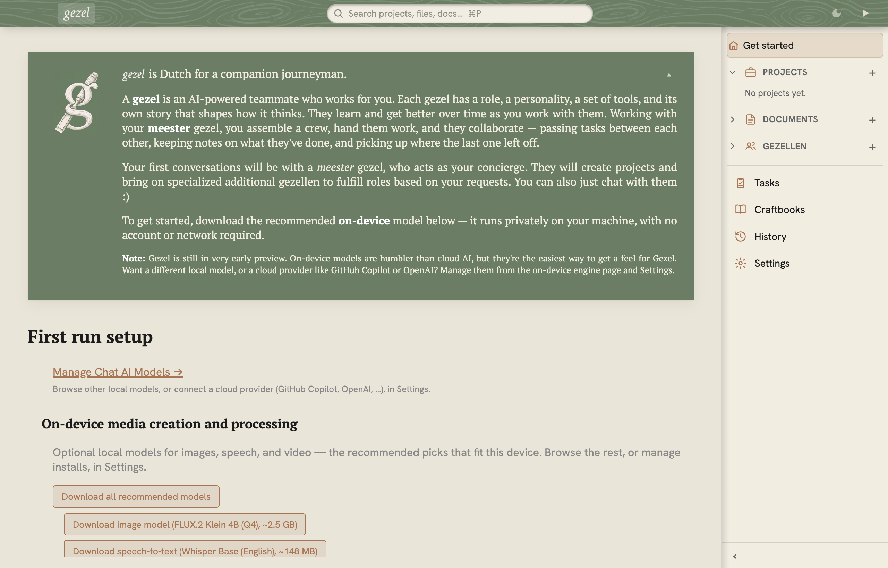

# Gezel

Gezel is a local-first desktop workshop for assembling a crew of named AI companions, giving them projects and tools, and keeping their work and memory on your machine.



Instead of starting with an anonymous chat, you meet the **Meester**: a guildmaster who helps you decide which specialists you need and puts a crew together. Each gezel has a name, role, working style, tools, sessions, and durable project context. You can use local models or connect a supported cloud provider.

> **Project status: early preview.** Gezel is usable, but installers, data formats, extension APIs, and model support may still change. Keep backups of important work and expect rough edges. Please [report issues](https://github.com/bendyline/gezel/issues/new).

## What “local-first” means

Gezel does not put a Bendyline cloud service between you and your models. The daemon, application state, projects, sessions, documents, memories, and rebuildable indexes live on the machine running Gezel. Primary state is stored in inspectable files where practical.

The default data location depends on how the daemon is hosted:

| Hosting mode | Default data location |
| --- | --- |
| Development or per-user daemon | `~/.gezel/` (or `$GEZEL_HOME`) |
| Windows system service | `C:\ProgramData\Gezel\` |
| macOS system service | `/Library/Application Support/Gezel/` |
| Linux system service | `/var/lib/gezel/` |

Local-first does **not** mean that every configuration is offline. Gezel uses the network when you choose a cloud model provider, install or invoke a networked toolset, search the web, download models or native engines, pair a remote inference device, or check for updates. Content sent to those services is governed by their policies. A local-model-only setup can keep inference local, but downloads and update checks can still use the network.

Packaged installs communicate with `gezeld` over loopback TLS using scoped bearer credentials. Gezel also runs model-authored tools and scripts, so treat untrusted content as potentially hostile and choose the security level appropriate for the project. Shared-machine deployments have an additional caveat: every account allowed to read the machine service's runtime credential is trusted as a first-party client.

Read [Security Architecture](docs/security-architecture.md) for the threat model, enforced controls, and known limitations. Report vulnerabilities privately through [Security Policy](SECURITY.md). Third-party components and their licenses are recorded in [NOTICE](NOTICE.md).

## Architecture

```text
Electron desktop app ─┐
CLI / other clients ──┼── loopback HTTPS + bearer token ──► gezeld
                      │                                     ├─ file-backed Store
                      │                                     ├─ sessions, tasks, memory
                      │                                     ├─ local/cloud model providers
                      │                                     └─ per-session MCP tool bridge
React UI ◄────────────┘
```

The Electron app is an OS integration shell and supervisor. The `gezeld` service owns state, provider routing, tools, background work, and the HTTP API. Clients use [`@bendyline/gezel-client`](packages/client) instead of assuming the service runs in-process, so the same protocol works with embedded, per-user, system-service, and configured remote hosting modes.

The main workspace packages are:

| Package | Purpose |
| --- | --- |
| [`@bendyline/gezel`](packages/core) | Shared schemas, path helpers, and core types |
| [`@bendyline/gezel-client`](packages/client) | Typed HTTP and event-stream client |
| [`@bendyline/gezel-service`](packages/service) | `gezeld`: API, state, providers, memory, and task execution |
| [`@bendyline/gezel-mcp`](packages/mcp) | MCP server that gives gezels their tools |
| [`@bendyline/gezel-ui`](packages/ui) | React application served by the daemon |
| [`@bendyline/gezel-app`](packages/app) | Electron shell, supervisor, and installers |
| [`@bendyline/gezel-cli`](packages/cli) | Headless `gezel` command-line client |
| [`@bendyline/gezel-catalog`](packages/catalog) | Bundled gezel, model, toolset, and craftbook catalogs |
| [`@bendyline/gezel-sdk`](packages/sdk) | Preferred extension and embedding surface |

See [AGENTS.md](AGENTS.md) for the full runtime model, disk layout, package map, and engineering conventions.

## Develop locally

Source builds require Node.js 24 or newer and the pnpm version pinned by the repository (`11.15.1`). CI uses Node 24, whose bundled Corepack can provision that pnpm version:

```bash
corepack enable
corepack prepare pnpm@11.15.1 --activate
pnpm install
pnpm build
pnpm dev
```

Useful checks before proposing a change:

```bash
pnpm typecheck
pnpm lint
pnpm test
pnpm test:e2e:web:run
```

Implementation contributions are not currently accepted. We do welcome issue reports and proposal-only pull requests; read [Contributing](CONTRIBUTING.md) and the [`specs/` guide](specs/README.md) before opening one. Contributors should also read [the engineering guide](AGENTS.md), [UX direction](docs/ux.md), and [Code of Conduct](CODE_OF_CONDUCT.md).

## License

Gezel is licensed under the [MIT License](LICENSE). Distributed builds also contain third-party software under additional terms; see [NOTICE.md](NOTICE.md).
