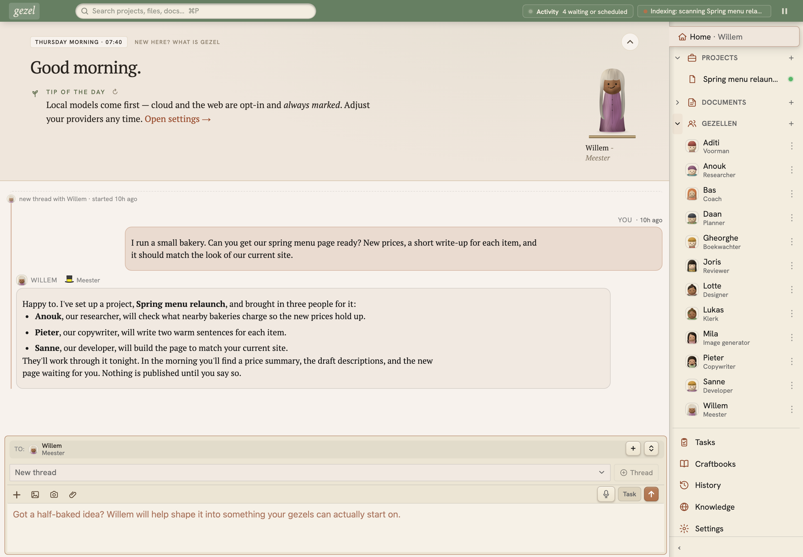

# Gezel

**Hand off a job tonight. Review it in the morning.**

Gezel is a free, open-source desktop app that gives you a crew of AI helpers (a researcher, a writer, a developer, and more) working on your own computer. Tell the Meester what you need and they bring in the right helpers. The work can run overnight, and in the morning it's waiting for you as reports and suggested changes. Your own files only change when you say so.

**[Download for macOS, Windows or Linux](https://gezel.com/#download)** · [Docs](https://gezel.com/docs/) · [Craftbooks](https://gezel.com/docs/craftbooks-index/) · [Models](https://gezel.com/docs/model-catalog/) · [Model scorecard](https://gezel.com/docs/model-scorecard/)



> **Project status: early preview.** Gezel is usable, but installers, data formats, extension APIs, and model support may still change. Keep backups of important work and expect rough edges. Please [report issues](https://github.com/bendyline/gezel/issues/new).

## What it does

- **A crew, not a chat box.** Each helper (a *gezel*, Dutch for journeyman) has a name, one role, a short list of tools, and a memory of past work. Your first conversation is with the Meester, who sets up the project and brings in the helpers it needs.
- **Work that keeps going while you're away.** The [Night Shift](https://gezel.com/docs/night-shift/) runs from 22:00 to 06:00 by default, or whenever you start it. Your crew works through tasks, reviews and indexing, and leaves a morning summary with reports and proposed changes for you to approve.
- **Tested plans for real jobs.** More than 250 [craftbooks](https://gezel.com/docs/craftbooks-index/), step-by-step plans with a quality check at the end, cover jobs such as research briefs, slide decks, Word documents, code reviews and websites.
- **Built for the AI on your computer.** Gezel recommends [models](https://gezel.com/docs/model-catalog/) that fit your hardware and runs them on bundled engines (llama.cpp and MLX). Focused roles and step-by-step plans are what let smaller models finish multi-step work, and we publish [measured results](https://gezel.com/docs/model-scorecard/) for the models we test.
- **Or use the plan you already pay for.** Gezel can work through the Claude, ChatGPT or GitHub Copilot plan you already have, using the Claude and Codex command-line tools or a Copilot sign-in. OpenAI and Anthropic API keys work too, and each gezel can use a different provider.
- **Yours, as plain files.** Projects, conversations and memories are saved on your own disk as Markdown, JSON and SQLite you can read, search and back up.

## What you need

| | Minimum | Recommended |
| --- | --- | --- |
| **Mac** | M1 or newer with 16 GB of memory | 24 GB of memory or more |
| **Windows or Linux** | A graphics card with 8 GB of its own memory (NVIDIA RTX 2070, 3070, 4060, 5060; AMD Radeon 6600, 7600) | 16 GB or more (NVIDIA RTX 4080, 5070 Ti; AMD Radeon 9070) |

The minimum runs everyday models for chat, drafting and focused single tasks. The recommended tier adds larger models for multi-step work with tools. Models download the first time you use them. Without hardware like this, you can use a cloud plan instead.

[gezel.com](https://gezel.com/#download) picks the right installer for your machine, and every build is also on the [releases page](https://github.com/bendyline/gezel/releases). Prefer a terminal? See the [CLI reference](https://gezel.com/docs/cli-reference/).

Linux installers require glibc 2.38 and the GCC 14.1 C++ runtime or newer, on both x64 and arm64. Ubuntu 24.04 LTS and Debian 13 meet these requirements; Ubuntu 22.04, Debian 12 and RHEL 9 do not. See the [native runtime requirements](docs/native-runtime-requirements.md) for details.

## What “local-first” means

Gezel does not put a Bendyline cloud service between you and your models. The daemon, application state, projects, sessions, documents, memories, and rebuildable indexes live on the machine running Gezel. Primary state is stored in inspectable files where practical.

The default data location depends on how the daemon is hosted:

| Hosting mode | Default data location |
| --- | --- |
| Development or per-user daemon | `~/.gezel/` (or `$GEZEL_HOME`) |
| Windows system service | `C:\ProgramData\Gezel\` |
| macOS system service | `/Library/Application Support/Gezel/` |
| Linux system service | `/var/lib/gezel/` |

Local-first does **not** mean that every configuration is offline. Gezel uses the network when you choose a cloud model provider, install or invoke a networked toolset, search the web, download models or native engines, pair a remote inference device, or check for updates. Content sent to those services is governed by their policies. A local-model-only setup can keep inference local, but downloads and update checks can still use the network.

Packaged installs communicate with `gezeld` over loopback TLS using scoped bearer credentials. Gezel also runs model-authored tools and scripts, so treat untrusted content as potentially hostile and choose the security level appropriate for the project. Shared-machine deployments have an additional caveat: every account allowed to read the machine service's runtime credential is trusted as a first-party client.

Read [Security Architecture](docs/security-architecture.md) for the threat model, enforced controls, and known limitations. Report vulnerabilities privately through [Security Policy](SECURITY.md). Third-party components and their licenses are recorded in [NOTICE](NOTICE.md).

Every release publishes a `SHA256SUMS` manifest and SLSA build provenance for each installer, so a download can be checked against what the pipeline actually produced. macOS and Windows installers are additionally signed and, on macOS, notarized; Linux packages are not GPG-signed, which makes these checks the verification path there. [Verifying your download](docs/handboek/technical/verifying-your-download.md) has the per-platform commands.

## Architecture

```text
Electron desktop app ─┐
CLI / other clients ──┼── loopback HTTPS + bearer token ──► gezeld
                      │                                     ├─ file-backed Store
                      │                                     ├─ sessions, tasks, memory
                      │                                     ├─ local/cloud model providers
                      │                                     └─ per-session MCP tool bridge
React UI ◄────────────┘
```

The Electron app is an OS integration shell and supervisor. The `gezeld` service owns state, provider routing, tools, background work, and the HTTP API. Clients use [`@bendyline/gezel-client`](packages/client) instead of assuming the service runs in-process, so the same protocol works with embedded, per-user, system-service, and configured remote hosting modes.

The main workspace packages are:

| Package | Purpose |
| --- | --- |
| [`@bendyline/gezel`](packages/core) | Shared schemas, path helpers, and core types |
| [`@bendyline/gezel-client`](packages/client) | Typed HTTP and event-stream client |
| [`@bendyline/gezel-service`](packages/service) | `gezeld`: API, state, providers, memory, and task execution |
| [`@bendyline/gezel-mcp`](packages/mcp) | MCP server that gives gezellen their tools |
| [`@bendyline/gezel-ui`](packages/ui) | React application served by the daemon |
| [`@bendyline/gezel-app`](packages/app) | Electron shell, supervisor, and installers |
| [`@bendyline/gezel-cli`](packages/cli) | Headless `gezel` command-line client |
| [`@bendyline/gezel-catalog`](packages/catalog) | Bundled gezel, model, toolset, and craftbook catalogs |
| [`@bendyline/gezel-sdk`](packages/sdk) | Preferred extension and embedding surface |

See [AGENTS.md](AGENTS.md) for the full runtime model, disk layout, package map, and engineering conventions.

## Develop locally

Source builds require Node.js 24 or newer and the pnpm version pinned by the repository (`11.15.1`). CI uses Node 24, whose bundled Corepack can provision that pnpm version:

```bash
corepack enable
corepack prepare pnpm@11.15.1 --activate
pnpm deps:install
pnpm build
pnpm dev
```

Useful checks before proposing a change:

```bash
pnpm typecheck
pnpm lint
pnpm test
pnpm test:e2e:web:run
```

The optional [visual regression suite](packages/app/e2e-visual/surfaces.spec.ts) compares reviewed
desktop, tablet, and phone baselines with `pnpm test:e2e:visual` on macOS 26 ARM64;
it is available locally or by manual workflow and does not block CI.

Implementation contributions are not currently accepted. We do welcome issue reports and proposal-only pull requests; read [Contributing](CONTRIBUTING.md) and the [`specs/` guide](specs/README.md) before opening one. Contributors should also read [the engineering guide](AGENTS.md), [UX direction](docs/ux.md), and [Code of Conduct](CODE_OF_CONDUCT.md).

## License

Gezel is licensed under the [MIT License](LICENSE). Distributed builds also contain third-party software under additional terms; see [NOTICE.md](NOTICE.md).
