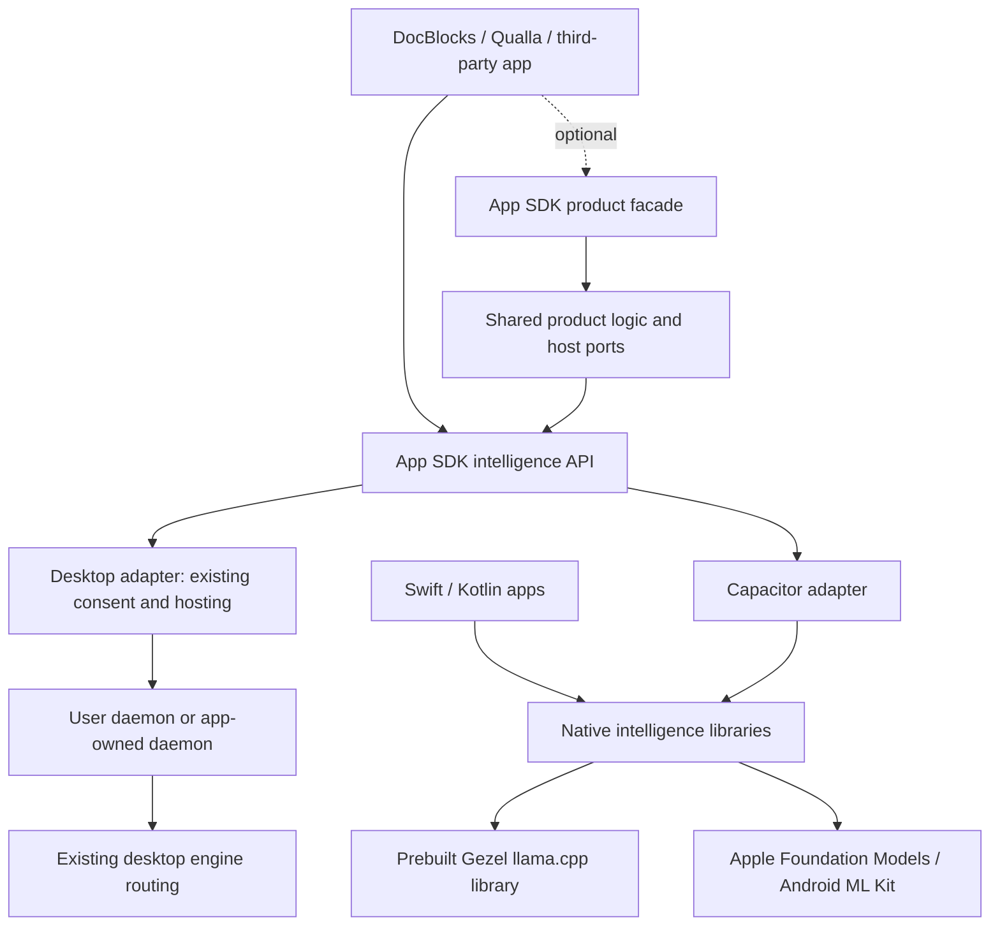

# App SDK: reusable intelligence across desktop and mobile

Assessment and proposed implementation plan, 2026-09-22. Based on the current
checkout, the owner's runtime-reunification notes (all five tranches completed
in the working tree), and the sibling DocBlocks and Qualla checkouts. Package names and API examples below are
proposals, not existing exports. This document does not change the
[App SDK stability contract](app-sdk-surface.md).

## Recommendation

Extend the **Gezel App SDK** into one family with two independently usable layers:

1. **Intelligence:** prepare a model, generate and stream text, cancel, inspect
   capabilities, and manage resources. An app supplies its own documents, UI,
   prompts, and conversation history. No Gezel project or crew is required.
2. **Product runtime:** opt into Gezel projects, sessions, tools, memories,
   scripts, and tasks through the existing shared client/domain boundaries.

Publish the mobile intelligence implementation as ordinary native dependencies:
a Swift package backed by prebuilt XCFrameworks, Android Maven artifacts containing
prebuilt JNI libraries, and a thin npm-distributed Capacitor plugin over both.
Gezel builds and tests llama.cpp once per supported target and release. Consumers
resolve a versioned dependency and build their own app; they never fetch llama.cpp
source, run its CMake build, or copy files from a Gezel checkout.

Start with Gezel mobile and Qualla as consumers of the same mobile packages, and
DocBlocks as the desktop API compatibility test. Keep implementation in this
repository initially. A small generated Swift package distribution repository may
be useful; a separate engine implementation repository is unnecessary.

The promise should be: **one application-facing intelligence contract, with
platform-specific setup and explicit capabilities.** It should not promise the
same model, quality, features, or process arrangement on every device.

## What is already available

| Area | Evidence in this checkout | Packaging implication |
| --- | --- | --- |
| Public desktop integration | [App SDK](../packages/app-sdk/package.json): Node discovery/consent, OpenAI-shaped `GezelApp`, browser entry, and optional `connectOrHost` | Preserve the 1.x API; add a portable intelligence entry rather than redefining the existing hosting API. |
| Portable product host | [`PortableProductService` and `PortableInference`](../packages/core/src/runtime/product-service.ts), [`PortableStore`](../packages/core/src/runtime/store.ts), injected Fetch in [mobile boot](../packages/mobile/src/main.tsx) | Mobile already runs without a REST listener. Reuse the product boundary when an app wants product features. |
| Shared execution after the refactor | Desktop [`ScriptRunner`](../packages/service/src/scripts/runner.ts) delegates to [`PortableScriptRunner`](../packages/script-runtime/src/runner.ts) through [`NodeScriptHost`](../packages/service/src/scripts/node-host.ts) | Do not plan another script runner extraction. Package the existing implementation behind a deliberately smaller public surface. |
| Shared product behavior after the refactor | Core task/gate/tool helpers, draft storage, path/question/backup policies, and [shared response/error helpers](../packages/core/src/runtime/http/errors.ts) | Shared policy and host-specific effects are already the architectural direction. Preserve the desktop authority checks. |
| Cross-host contract coverage | [HTTP parity](../packages/service/src/http/portable-parity.test.ts), [backup interoperability](../packages/service/src/storage/backup-portable-interop.test.ts), [tool parity](../packages/mcp/src/portable-tool-parity.test.ts) | Extend this testing pattern to the SDK contract and packed consumer dependencies. These files are evidence of coverage being authored, not a claim that this assessment ran the refactor's tests. |
| Native text engine | [C ABI v1](../native/mobile/gezel_llama.h), [pinned builder](../native/mobile/build-llama.py), XCFramework and Android `.so` outputs | The binary foundation exists. It needs a supported distribution and compatibility contract. |
| Platform AI | [Apple adapter](../packages/mobile/native/ios/Plugin/AppleFoundationProvider.swift), [ML Kit adapter](../packages/mobile/native/android/java/com/bendyline/gezel/mobile/MlKitPrompt.java) | Extract these into native libraries independent of Capacitor and Gezel product storage. |
| Model lifecycle | Native download managers, verified provenance, resumable staging, cancellation barriers, foreground/resource admission | Reuse these mechanisms; expose model ownership and preparation independently of the Gezel settings UI. |
| Speech | [Mobile speech bridge](../packages/mobile/src/speech.ts) and [native speech work](mobile-speech.md) | A valuable follow-on module, particularly for Qualla; not a mandatory text dependency. |

The refactor reduces the amount of domain logic that needs moving. It does not
yet make the mobile runtime an external SDK:

- [`@bendyline/gezel-mobile`](../packages/mobile/package.json) remains a private
  application package containing React UI and product boot code.
- [`GezelMobilePlugin`](../packages/mobile/src/native.ts) combines inference with
  product files, import/export, previews, and model management.
- The [Android app build](../packages/mobile/android/app/build.gradle) includes
  native source directories and invokes a [JNI CMake project](../packages/mobile/native/android/cpp/CMakeLists.txt)
  that knows the Gezel repository layout and links speech alongside llama.cpp.
- iOS links a locally built XCFramework. The current native `Package.swift`
  publishes a storage library, not a reusable inference SDK.
- Native CI verifies Gezel app builds. It does not establish that a fresh
  third-party app can resolve public native packages without this checkout.

Also distinguish **hosting the Node service in-process** from **linking the
inference library in-process**. The existing desktop host mode concerns where
the service runs; desktop engines may still be subprocesses. There is no need to
change that to make the public inference contract consistent.

### Preserve the reunification decisions

The existing reunification is the foundation, not another work item to repeat.
Its explicit boundaries also constrain this SDK plan:

| Shared once | Deliberately supplied by each host |
| --- | --- |
| Pure policy, schemas, routing/gate math, error mapping and contract fixtures | Device budgets, resource limits, scheduling and platform authority |
| Draft behavior through a storage port | Desktop filesystem/locking/multi-root storage versus portable filesystem/journaling |
| Script runner with a host port | Node sandbox execution versus mobile execution and available dispatcher methods |
| Tool definitions and task context policy | Native desktop function calling/MCP versus the portable JSON tool loop |
| Response builders and error semantics | Desktop authenticated HTTP router versus portable in-process Fetch router |
| Search ranking and backup policy | Search engines, ZIP writers and host-specific operations |

Follow the owner's rule that stricter shared behavior wins while device budgets
remain host-supplied. The SDK must not move the desktop onto `PortableStore`,
replace the desktop chat/task runners, centralize all routes into a table, or
rewrite eval-tuned desktop tool descriptions. Uniform public semantics do not
require identical host implementations. Preserve the desktop MCP registration
wrapper and its guards when connecting optional product tools.

Four decisions remain outside the inference release: the task activation ledger
identity (`lifecycle.json` versus `onEnterCompletedAt`), a chain guard for desktop
`messageGezel`, whether a scripts-only route-table pilot is worthwhile, and the
public treatment of `inlineSource`. Resolve or explicitly delimit these before
promising portable task/script orchestration to third parties. The noted skipped
portable `script-host-contract.test.ts` should become an acceptance gate for that
optional product release. None blocks packaging native text inference.

## Architecture and package boundaries



The diagram describes the target dependency direction, not a requirement to
reroute all existing desktop provider internals in the first release. Initially,
the desktop intelligence adapter wraps the existing App SDK, and the portable
product host gets an adapter from its `PortableInference` port to the new runtime.

| Proposed surface | Responsibility | Consumer setup |
| --- | --- | --- |
| `@bendyline/gezel-app-sdk/intelligence` | Platform-neutral client, capabilities, request/result/event types, model preparation, errors | Common TypeScript import; no Node, Capacitor, React, or service runtime imports |
| Existing App SDK Node and `./host` entries | Discovery, scoped consent, existing daemon or app-owned hosting, adapter to intelligence | Existing desktop integration plus a small adapter/factory |
| `@bendyline/gezel-capacitor` | Native registration, event bridge, lifecycle integration, native dependency declarations | Install with the App SDK, then normal Capacitor sync/build |
| Swift package `GezelIntelligence` | Native Swift API and platform provider/lifecycle/model management | Add an exact Swift package version; select the required products |
| Maven `com.bendyline.gezel:intelligence` and engine/provider modules | Native Android API, model management and provider composition | Add a dependency; ordinary Gradle resolution |
| Optional product facade, initially experimental | Stable access to the supported portable product operations | Explicit opt-in to product/runtime dependencies |
| Optional speech module | Speech APIs and their native payloads | Separate dependency and preparation; text-only apps omit it |

Use a small number of developer-facing dependencies. Native modules can separate
`llama`, `system-ai`, and eventually `speech` internally, with a documented default
composition. An app wanting only system AI should be able to omit llama.cpp;
an app wanting only GGUF should be able to omit ML Kit. Do not require developers
to configure ten independent adapters to get their first answer.

Keep wire schemas in core, following repository conventions, and export them
through a narrow browser-safe subpath. Generate or validate native DTOs against
those schemas and shared fixtures. Avoid importing the whole runtime barrel into
the inference-only bundle. Audit the packed dependency graph, not just source
imports: a browser-safe entry must actually bundle without Node polyfills. Keep
the package's Node build-tool requirement distinct from its mobile runtime needs.

The native Swift/Android libraries must work without a WebView. This makes
Capacitor one binding and leaves room for React Native, Flutter, and other FFI
bindings later. Those bindings are not part of the first implementation.

## Public API and routing contract

Retain the familiar `chat`, `models`, and cancellation vocabulary. Add a portable
facade rather than widening every current desktop model/provider union. In
particular, the existing `EnsureModelEngine` union has daemon-specific semantics;
mobile system providers must not be added to it without matching daemon support.

The first contract should cover:

| Operation | Required semantics |
| --- | --- |
| `capabilities()` / status subscription | Current provider/model availability, reason, modality support, limits, locality, preparation actions, foreground requirement |
| `plan(...)` | Select an eligible candidate without downloading or loading; return selected destination, model identity, required preparation, bytes when known, and why |
| `prepare(plan, options)` | Explicit model preparation/download/load with progress and cancellation; return the prepared model handle; revalidate stale plans |
| `chat(request, { signal })` | Text completion or stream; use the prepared model identity; reject unsupported options before starting |
| `models()` / model management | Installed and available models, explicit removal, storage usage, provenance; distinguish app-owned and system-owned assets |
| `close()` | Cancel/drain this client's work and release owned resources; never stop a borrowed daemon |

Illustrative proposed usage:

```ts
// Mobile composition root. These are proposed APIs.
import { createIntelligence } from '@bendyline/gezel-app-sdk/intelligence';
import { createMobileRuntime } from '@bendyline/gezel-capacitor';

const ai = createIntelligence({
  runtime: createMobileRuntime(),
  policy: { locality: 'on-device', fallback: 'none' },
});

const plan = await ai.plan({ capability: 'text', model: 'auto' });
// The app presents any setup/download action described by plan.
const model = await ai.prepare(plan, { allowDownload: true, onProgress });
const stream = await ai.chat({
  model: model.id,
  messages: [{ role: 'user', content: 'Summarize this passage: ...' }],
  stream: true,
}, { signal });

for await (const chunk of stream) {
  appendText(chunk.choices[0]?.delta?.content ?? '');
}
// Keep ai alive for the feature's lifetime; close it when its owner ends.
```

Desktop supplies an adapter over an authorized `GezelApp` or an existing hosted
connection. The feature code after initialization stays the same. For Electron,
discovery, credentials, and hosting stay in main; use a narrow preload bridge for
renderer calls. A plain website receives no native inference implementation by
installing this npm package; it reports unsupported or uses an explicitly
configured connection.

Use OpenAI-shaped messages and chunks where they fit, with a documented supported
subset. Do not imply full OpenAI API compatibility on mobile. Preserve existing
SDK responses unchanged; the new facade may expose optional usage and an unknown
finish reason when a platform cannot report them. Never invent token counts or
quietly ignore tools, images, sampling controls, or output-schema requirements.

The current [mobile provider schema](../packages/core/src/schemas/mobile-provider.ts)
explicitly reports tools, structured output, and images as unsupported. The C ABI
also supports text only and starts a fresh KV context from the supplied
transcript. The portable product's JSON tool loop is a separate orchestration
feature, not evidence of native tool-calling support. Publish capability levels
such as native versus orchestrated only when those paths have their own tests.
Embeddings remain optional until an actual mobile embedding provider exists.

Routing rules:

1. An explicit provider/model selection wins. Preserve it across turns.
2. For `auto`, filter by required capabilities, locality, language, and resource
   limits first. Prefer a ready supported system provider, then a ready eligible
   app-owned model. An app may configure a different order.
3. If preparation is needed, return that state. A capability probe never
   initiates a GGUF download or warms the engine. Platform SDK checks may have
   their own system-service/network behavior; do not advertise probing as a
   blanket zero-network guarantee.
4. A declined desktop connection, authentication error, unhealthy daemon, or
   unavailable selected model remains visible. Preserve `connectOrHost`'s
   existing limited fallback rules.
5. No mid-stream replay or provider switch. Model refusal is an outcome, not an
   invitation to route around it. Fallback before a request is a separate,
   explicitly configured policy.
6. Distinguish `on-device`, `paired-device`, and `cloud`. A desktop daemon can
   itself route remotely, so transport locality alone does not prove inference
   locality. Enforce the requested constraint at execution, fail closed when an
   older daemon cannot attest/enforce it, and report the actual destination.

Apple's model availability has explicit unavailable states, and ML Kit requires
runtime status checks. Treat these as ordinary API states, with actionable reasons,
rather than assuming the OS version guarantees access. System model preparation
and cancellation need platform-specific descriptions: the SDK cannot promise it
can force Apple's model download or delete an Android system-owned model.
[Apple availability](https://developer.apple.com/documentation/foundationmodels/systemlanguagemodel/availability-swift.enum),
[ML Kit preparation and inference](https://developers.google.com/ml-kit/genai/prompt/android/get-started).

## Native distribution: build once, consume normally

### Apple

Publish `GezelLlama.xcframework.zip` at an immutable versioned URL. Wrap it in a
Swift package binary target with a checksum. A source Swift wrapper can expose
idiomatic `async`/`AsyncThrowingStream` APIs while the expensive C/C++ code remains
prebuilt. Package Metal resources and transitive link requirements, license
notices, and debug symbols where applicable. This follows Apple's supported
[binary Swift package distribution](https://developer.apple.com/documentation/xcode/distributing-binary-frameworks-as-swift-packages).

Initial supported targets: iOS/iPadOS arm64 device with Metal and arm64 simulator
with CPU. Decide and publish whether Intel simulators are supported; the current
builder selects one simulator architecture per invocation, so a universal
simulator distribution needs explicit assembly/verification. Do not advertise
macOS, tvOS, or visionOS merely because XCFrameworks can contain those platforms.

Separate the engine deployment floor (currently iOS 16.4) from Foundation Models
availability (the current adapter gates at iOS 26) and the compiler/SDK floor
(the current adapter references iOS 27 symbols). Audit whether conditional
compilation can reduce the consumer Xcode requirement without dropping tested
behavior. A runtime availability check alone cannot solve a missing compile-time
SDK symbol. Publish the tested Xcode/Swift matrix.

Make Capacitor consume the same Swift products. Support the Capacitor 8 SPM path
first; add a CocoaPods wrapper only if a supported consumer needs it, referencing
the same binary artifacts rather than compiling another engine.

### Android

Publish AARs through a public Maven repository, preferably Maven Central, with
POM/Gradle metadata and transitive dependencies. The AAR must contain the Gezel
JNI bridge **and** the required llama/ggml shared libraries. A consumer must not
need `externalNativeBuild`, the Gezel NDK revision, or a copied `jniLibs` folder
for this SDK. Android recommends repository publication rather than loose AAR
distribution because metadata carries dependencies.
[Android library publication](https://developer.android.com/build/publish-library/upload-library).

Start with arm64-v8a real devices and a clearly documented minimum API (currently
28). Add x86_64 emulator binaries before claiming conventional emulator support.
Give GGUF, ML Kit, and speech separate dependency edges. Include consumer R8 rules
for JNI and verify minified release builds; Gezel's current non-minified app build
does not prove an external app will retain the necessary bridge classes.

Test ELF alignment and final APK/AAB packaging for 16 KB page sizes, including
every bundled dependency. The current build already checks parts of this; carry
those checks into consumer release tests.
[Android 16 KB support](https://developer.android.com/guide/practices/page-sizes).

Resolve C++ runtime collisions deliberately. Do not tell consumers to fix duplicate
`libc++_shared.so` with an arbitrary `pickFirst`. Verify a compatible shared runtime
policy, or evaluate internal static linkage without C++ objects crossing the ABI.
Hide non-public symbols and test coexistence with another native ML dependency.
The current XCFramework module map exports `llama.h`; the supported public boundary
should be Gezel's versioned C ABI, with upstream headers kept private.

### Release ownership and compatibility

Build from the canonical [llama.cpp pin](../native/engines/llama-cpp/VERSION). Record
the actual patch set: the mobile builder currently archives the pinned source and
deliberately excludes desktop patches. Sharing a pin does not establish identical
features or model behavior.

Each release manifest should identify public SDK version, bridge protocol version,
C ABI version, native artifact version, upstream commit/patches, toolchains,
minimum OS/ABI targets, model-format compatibility, checksums, notices, and test
evidence. Keep these version axes distinct; upgrading llama.cpp is not necessarily
a breaking SDK API change.

Use immutable artifacts, provenance/signatures where supported, exact dependency
pins in reference apps, and checksums verified during dependency resolution and
packaging. Stage the complete compatible artifact set before publishing the npm
plugin or native wrapper version that references it. Extend the existing npm
tarball/registry verification with fresh SPM and Maven consumer builds.

Native binaries ship inside the consuming app's signed release. Model weights
are separately managed data. The default integration must never download a new
native engine at application runtime. An engine fix requires a dependency update
and a new app release; publish release notes and deprecations accordingly.
Provide an explicit source-build escape hatch for unsupported targets, outside
the supported zero-engine-build path.

## Model ownership, lifecycle, and product scope

**Reusing a build does not imply sharing one installed GGUF across mobile apps.**
Use app-private model storage by default. Android isolates application resources;
Apple App Groups support sharing for apps from the same development team, not a
general third-party shared Gezel model directory. A same-team shared cache could
be a later opt-in feature with locking, integrity, quota, and removal rules.
[Android sandbox](https://source.android.com/docs/security/app-sandbox),
[Apple App Groups](https://developer.apple.com/documentation/xcode/configuring-app-groups).

Accordingly, an installed Gezel mobile app is not a prerequisite or an assumed
always-running local daemon. Each app links the library; system AI uses the
platform's model service. Optional paired-computer inference is a separate later
adapter, using authenticated native TLS and explicit authorization. It does not
give the computer ownership of mobile projects or access to their files.

Extract the existing model manager behind a configurable app-private storage
root. Preserve streamed verification, resumable staging, atomic activation,
interruption recovery, free-space checks, unload-before-delete, and opaque model
handles. Exclude weights from ordinary device backups where appropriate.

Support bundled model files, user imports, and signed/pinned model descriptors.
Keep Gilde as the canonical source for Gezel's recommended models; do not fork
its catalog into the SDK. Allow apps to ship a small selected descriptor set
without pulling in the whole Gezel catalog/product runtime. The present downloader
is Hugging Face-specific and capped at 4 GiB: retain that supported lane initially.
App/CDN sources require a deliberate native download-source extension, host-defined
allowlists, immutable identity, size, hash, and licensing metadata. Never turn the
WebView bridge into an arbitrary URL-to-filesystem downloader.

Native runtime responsibilities must include a shared admission gate across its
providers, bounded queuing, cancellation tied to an operation ID, and a release
barrier before admitting replacement work. Multiple SDK clients in one app must
share resource admission rather than each loading a model independently. Stop and
release on memory pressure/background transitions according to the supported
foreground policy; do not promise background agent execution. Preserve Gezel's
awake-time deadline semantics. Cancellation stops computation, not merely the JS
reader, and late callbacks cannot belong to a new request.

Keep credentials and privileged connections in native/main-process storage.
Limit the Capacitor plugin to its packaged trusted app context; embedded authored
HTML and remote pages must not gain inference, download, or file authority.
Reuse the existing preview/bridge boundary tests when splitting the plugin.

The optional product layer should wrap the existing host runtimes and their shared
domain code, not export every internal class as a stable SDK. Keep filesystem authority, tool permissions,
durability, and script executor choice in host ports. Full desktop MCP, terminals,
cloud credentials, and background jobs remain separately advertised capabilities.
For pure Swift/Kotlin apps, the first release provides inference only; do not imply
that the TypeScript product runtime automatically runs natively.

## Adoption in the two example apps

### DocBlocks

The current sibling checkout already defines `DocBlocksHostAiAPI` in
`packages/core/src/host/ai.ts`, with provider-neutral models, status, streaming,
cancellation, and individually optional search/image/speech methods. Its desktop
package does not currently declare the App SDK dependency, and the inspected
source does not establish a completed Gezel provider implementation.

Implement the provider behind that existing host seam. Preserve its expected-error
`AiResult` mapping, opt-out behavior, host-generated request IDs, and narrow
main/preload boundary. Start with summarize/rewrite over caller-supplied document
text. Keep document mutation under DocBlocks' `DocumentSession` transaction
boundary. A model returns a proposal; it does not bypass document commit rules.

Use desktop installed-daemon discovery first and opt-in app-owned hosting as
already designed. Prove the same SDK request fixtures against the mobile adapter
without requiring DocBlocks to acquire a mobile shell for this project. A future
mobile host can satisfy the same AI seam. Workspace indexing, image generation,
and speech remain optional and capability-gated.

### Qualla

The current checkout has Electron in `app/`, a Preact web frontend, Capacitor
8.5.2 in `mobile/`, and native Swift `QuallKit` shared with CarPlay/tvOS work. That
makes Qualla the first external Capacitor integration and a useful future native
Swift consumer. The core SDK and plugin must have no React dependency.

Start with one bounded offline feature: summarize or answer questions about an
already-downloaded place/article. Qualla supplies retrieved context and owns
location permissions, user state, and narrative rules. Use the same application
feature code with desktop and Capacitor initialization. Test both supported system
AI and GGUF, including a device without system AI.

Add speech next if the feature needs it, without replacing existing narrated-media
playback. Keep knowledge retrieval separate: Qualla's use of the Gezel knowledge
toolchain does not establish that its Node/native readers are mobile-ready.
tvOS and CarPlay background generation need distinct support and lifecycle
decisions; do not include them implicitly in the iOS claim. Plain web and MSFS
surfaces must degrade to unavailable or an explicit connection without loading
native packages into their bundles.

## Delivery sequence and acceptance gates

Deliver vertical increments. Neither a full product-runtime public API nor a
desktop engine rewrite should block a reusable mobile text release.

| Phase | Work | Exit gate |
| --- | --- | --- |
| 0. Freeze the first contract | Inventory post-refactor imports; specify inference states, locality enforcement, cancellation and model identity; choose support matrix and artifact names | Reviewed API fixtures plus dependency diagram; separate existing behavior from new exports |
| 1. Extract native libraries | Move inference/provider/model code out of the app plugin; separate product storage, previews, and speech; make Gezel mobile consume the extracted modules | Gezel's existing native/bridge regression scenarios still work with no duplicate engine/provider implementation |
| 2. Publish a consumable preview | Build precompiled XCFramework and AAR/JNI artifacts; add Swift/Maven wrappers and Capacitor package; publish coordinated preview versions | Fresh Swift, Android, and Capacitor apps build and run without the Gezel checkout, llama source, or a C++ engine build |
| 3. Unify desktop and mobile API | Add portable App SDK facade and desktop adapter; retain existing 1.x API; connect the portable product inference port to the same adapter | Shared completion/stream/cancel/error/locality fixtures pass across desktop and native bridges; existing SDK surface tests remain intact |
| 4. Adopt in real apps | Qualla mobile/desktop place summary and DocBlocks desktop text transformation; record setup friction and package size | Both apps use released artifacts, no copied Gezel source/build scripts; feature code stays provider-neutral |
| 5. Support a stable public release | Physical-device qualification, package/security/lifecycle tests, reference apps, docs and upgrade policy | Supported matrix and known limitations published; release candidates pass isolated consumer gates |
| Later, independently | Speech package, embedding/retrieval adapters, optional product facade, paired-device inference, additional bindings/targets | Each has its own capabilities and consumer acceptance tests |

Phases 1 and 2 are the first investment: they directly eliminate per-app engine
builds. Phase 3 can develop against those preview artifacts. Carry forward the
reunification's gate evidence rather than repeating the five completed tranches;
this plan does not require completing all desktop/mobile parity work.

When implementation changes core or script-runtime, rebuild their existing dist
outputs before service/MCP checks: those packages resolve built outputs. The
owner's notes identify existing Gilde schema-freshness and module-size failures;
track their disposition separately from packaging regressions. This planning-only
assessment has not rerun or certified those gates.

Required qualification should include:

- Fresh package-manager consumption outside the monorepo, with native source and
  Gezel-relative paths absent. Warm-cache offline rebuilds after dependencies have
  been resolved. A system-only build must omit the GGUF/speech payloads.
- A real streamed completion, cancellation during loading/prefill/generation,
  Unicode chunk boundaries, context overflow, unavailable providers, disposal,
  repeated requests, two clients competing for admission, and unsupported options.
- Physical iPhone/iPad and Android tests for memory pressure, thermal admission,
  background/foreground, process death, and download interruption. Simulator
  fixtures establish bridge correctness, not model quality or device suitability.
- Exact native/bridge mismatch rejection, minified Android release builds,
  supported simulator/device slices, final signed/archive loading, duplicate native
  dependencies, model hash failures, and no runtime executable downloads.
- Desktop consent denial/revocation and stale daemon compatibility; no accidental
  cloud or paired-device execution under an on-device-only policy.
- Small real-model feature evaluations for DocBlocks and Qualla, per provider and
  device tier. Record latency, memory, package size, download size, and quality;
  set release thresholds from measurements rather than inventing universal budgets.

The developer experience acceptance target is concrete: **add the documented
dependency, supply the app's identity/configuration, prepare a supported model,
and stream a response with cancellation**. Ordinary app builds and signing remain
the consumer's job. Native engine compilation, upstream pinning, bridge maintenance,
and binary compatibility testing become Gezel's job.
