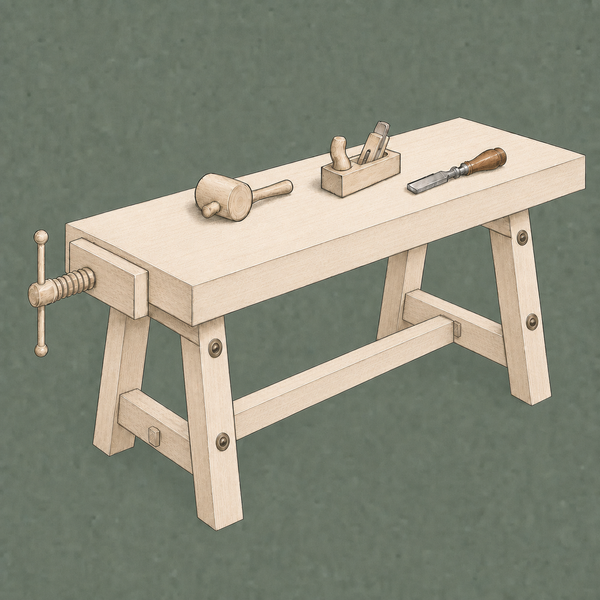

# What is gezel?

[Watch the Gezel playlist on YouTube](https://www.youtube.com/watch?v=KCdgV5YFDzI&list=PLaD2JMwhPJ3w) for a quick introduction and guided tours.

*Gezel* is Dutch for a companion journeyman. A **gezel** is an AI teammate who works for you: each one has a name, a face, a role, a set of tools, and its own story that shapes how it thinks. They remember what you've done together and get better over time as you work with them.

## A crew, not a chat

Most AI tools hand you a blank text field. Gezel hands you a crew — a small workshop of *gezellen* you assemble yourself: a researcher who digs into questions, a copywriter who drafts, a reviewer who checks, a developer who builds. Hand them work and they collaborate — passing tasks between each other, keeping notes on what they've done, and picking up where the last one left off.

## Start with your Meester

Your first conversations are with a **Meester** gezel: the guildmaster who acts as your concierge. Ask for what you need and they'll create projects and bring on specialized gezellen to fill the roles. You can also just chat with them :)

## Your data stays yours {[pullQuote]}

When you use local downloaded models, everything gezel does is powered by your device - no cloud account or expense required, and everything gezel creates lives on your own device.

## Where to go next

- Meet the crew model in [Your crew](the-crew.md).
- See how work is organized in [Projects and threads](projects-and-threads.md).
- Browse what your gezellen can do by role in the Gezel Roles section of this Handboek.
