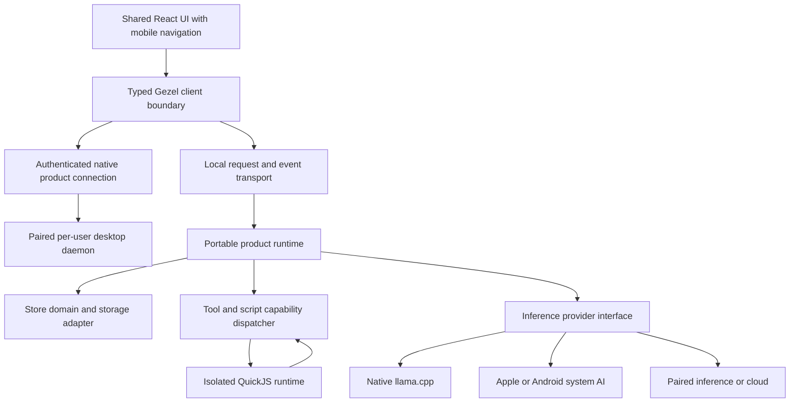

# Gezel on Android, iPhone, and iPad

Implementation plan — 2026-09-19. Based on the current checkout and linked upstream documentation. The first foundations below are implemented; the mobile application and native product/inference bridges remain planned. Effort estimates are planning ranges, not delivery commitments.

**First implementation increment**

- The SDK now exposes a platform-independent `createGezelSDK(transport)` factory through `@bendyline/gezel-sdk/portable`. Desktop scripts keep the existing default import and fd-3 transport.
- `ScriptRunner` delegates execution through a host-selected `ScriptExecutor`. The existing Node sandbox remains the default. Metadata validation, capability checks, engagement restrictions, output validation, audit history, and redaction remain in the runner/dispatcher.
- [`@bendyline/gezel-script-runtime`](../packages/script-runtime/README.md) implements an experimental QuickJS-WASM executor. The desktop service can exercise it in a dedicated worker with the actual SDK and dispatcher, bounded memory/calls/messages, cancellation, and awake-time deadlines. Selection is a trusted host constructor option, never script metadata. This is a portability/conformance harness; mobile native QuickJS integration remains open.
- [`native/mobile`](../native/mobile/README.md) builds pinned llama.cpp libraries for iOS and Android. The iOS arm64 device/simulator XCFramework built successfully, passed link probes, and imported from Swift. Android preflight requires an installed NDK, absent on the implementation machine; Android compilation is unverified. No model has run on a phone yet.

Next is a narrow mobile application slice: native storage and request/event transport, a small crew/chat UI, a Swift/JNI inference bridge, and a persisted offline conversation on actual devices. Apple/Android system AI adapters and desktop companion product authorization remain separate later work. The broader sections below describe that target architecture, not shipped mobile functionality.

**Recommendation**

Build a mobile application that can own its gezels, conversations, documents, and short tasks locally. Reuse the React UI through a Capacitor shell, extract a small portable TypeScript product runtime, embed llama.cpp as a native library, and introduce a QuickJS implementation of the script execution interface. Add Apple and Android system AI as separately evaluated providers. Keep desktop connectivity as a complementary mode for larger models and work requiring a computer.

The largest investment is making product logic independent of Node and subprocesses. Compiling the inference engine and interpreter is necessary, but does not itself make the daemon portable. Start with a complete, narrow offline workflow on both operating systems before expanding coverage.

**1. What the current code gives us**

| Existing boundary | Reuse and required change |
| --- | --- |
| [React UI and desktop bridge](../packages/ui/src/api.ts) | Reuse components, schemas, characters, and visual language. Replace direct `window.__GEZEL__` dependencies with a platform interface; build phone navigation. |
| [Typed client](../packages/client/src/client.ts) | It already accepts an injected fetch implementation. Preserve its request, error, cancellation, and event contracts while adding a local mobile transport. Binary/media URLs and streams need more than a JSON request shim. |
| [Provider contracts](../packages/service/src/providers/types.ts) | Extract the useful inference/session contracts; current types also reference service queues, MCP process configuration, and provider-specific behavior. They are not a ready-made mobile package. |
| [Native engine runtime](../packages/service/src/providers/native/local-engine-runtime.ts) and [llama build](../native/engines/llama-cpp/build.sh) | Reuse model metadata, admission concepts, and upstream pinning. Current builds produce a server executable; mobile needs linked libraries and a different lifecycle. |
| [Script runner](../packages/service/src/scripts/runner.ts), [SDK RPC](../packages/sdk/src/rpc.ts), and [dispatcher](../packages/service/src/scripts/dispatcher.ts) | Strong starting point: scripts already use a capability-checked API. Execution currently depends on Node type stripping, a child sandbox, stdin initialization, and fd-3 RPC. Separate these implementation details from the SDK contract. |
| [Script metadata](../packages/service/src/scripts/meta.ts) and [standard scripts](../packages/script-stdlib/scripts) | Preserve literal-only metadata extraction before execution. The initial scan found no direct Node imports, `Buffer`, `process`, or raw `fetch` in non-test standard scripts; useful evidence for portability, not a compatibility guarantee. |
| [Product/engine separation](service-boundaries.md) | Preserve it. The phone can consume remote inference without transferring ownership of its projects or granting remote filesystem access. |
| [Remote product design](remote-access.md) and [accounts ADR](decisions/0004-accounts-and-project-acls.md) | A desktop companion needs additional work. The product listener is loopback-only; existing LAN pairing exposes inference, not projects, chats, or tools. |

The service also relies on native SQLite bindings, Node filesystem APIs, OS sandboxes, process supervision, Python, CLI providers, and stdio MCP. Inventory transitive imports before labeling a package portable; core already has useful subpath exports, but its path helpers deliberately import Node.

**2. Separate where the work lives from where the model runs**

Offer two product arrangements:

| Arrangement | State and execution owner | Initial scope |
| --- | --- | --- |
| Standalone mobile | Phone/tablet owns the project, tools, scripts, and task checkpoints | Crew, Meester, chat, imported documents, artifacts, short craftbooks |
| Desktop companion | A paired per-user desktop daemon owns the project and executes its tools/tasks | Browse, chat, approve, monitor, and retrieve results from that computer |

A standalone mobile project can choose among these inference providers:

| Provider | Integration | Availability and intended use |
| --- | --- | --- |
| Downloaded local model | llama.cpp C/C++ library | Common offline engine across iOS and Android; offer models verified for the device class |
| System AI | Apple Foundation Models / Android ML Kit GenAI | Optional provider, discovered at runtime; initially focused writing, extraction, and summarization |
| Paired computer inference | Existing inference protocol through a native TLS client | Bigger models while the phone retains project ownership; model receives selected context, tools execute on the phone |
| Cloud provider | Mobile-compatible HTTPS provider adapter | Explicitly configured by the user; credentials stay in the native vault |

Persist these choices independently. A failed local inference request must not silently upload content to a cloud provider or transfer a task to a computer. Show the selected execution device and data destination. Remote inference is still data transmission even though it is the user's own computer.

Use one model at a time initially: the crew can retain distinct identities while sharing a serialized inference queue. Multiple gezels do not require multiple resident models.

**3. App shell and portable product runtime**

Use [Capacitor](https://capacitorjs.com/docs) as the initial shell candidate because it can package the existing web UI and integrate native plugins. Validate this choice on actual hardware in the first spike. React Native would preserve much TypeScript logic but require replacing the DOM UI; full SwiftUI/Compose apps would duplicate more presentation work. Keep those alternatives available if the WebView fails measured accessibility, memory, or interaction goals.

Proposed structure:



The trusted product runtime runs as bundled JavaScript in a dedicated Web Worker for the foreground-first release. A small main-thread bridge forwards typed messages to native plugins; do not assume Capacitor plugins work directly inside a worker. Native inference, file I/O, downloads, and script evaluation run off the UI thread. Lifecycle events checkpoint the runtime before suspension when possible; durability must also withstand termination without a final callback.

Do not run user scripts in that worker or the UI's JavaScript context. Do not use QuickJS as a way to boot the existing Node daemon. App-owned TypeScript and untrusted script execution have different requirements.

Suggested module boundaries, introduced only as working slices need them:

| Proposed location | Responsibility |
| --- | --- |
| `packages/mobile` | Capacitor app, Swift/Kotlin plugins, lifecycle, platform permissions, mobile composition root |
| `packages/runtime-core` | Portable session/turn orchestration, Store domain operations, task transitions, capability evaluation; no Node, DOM, or native imports |
| `packages/script-runtime` | Script execution interface, portable SDK transport, compilation/metadata contract, QuickJS adapter boundary |
| `native/mobile` | Small stable C ABI over llama.cpp, reproducible iOS/Android library builds, native test harness |
| Existing service and client | Desktop adapters, HTTP transport, and contracts shared with the mobile transport |

Ports should cover storage, secrets, inference, tool dispatch, script execution, events, HTTP, clocks, and lifecycle. Avoid introducing a universal operating-system abstraction or moving entire managers before a use case requires them. Extract portable logic from ChatManager while preserving one owner of session state; retain desktop-specific orchestration in the service.

The existing rule to go through the client/API remains the architectural boundary. The proposed mobile evolution uses an in-process request/event transport behind it, rather than requiring a mobile localhost server. Desktop HTTP remains unchanged. Contract tests must cover stream ordering, cancellation, errors, subscriptions, uploads, and resource URLs, including any compatibility shim around injected fetch.

Keep the product runtime foreground-bound initially. Continuing native inference briefly in the background does not imply that a suspended WebView can run a tool loop. If long mobile tasks become essential, make a separate decision about an app-owned native orchestration host after the initial release.

**4. llama.cpp on both platforms**

Upstream supplies an [Android binding/build guide](https://github.com/ggml-org/llama.cpp/blob/master/docs/android.md) and an [XCFramework build script](https://github.com/ggml-org/llama.cpp/blob/master/build-xcframework.sh). Start from Gezel's pinned commit and verify those facilities at that revision; upstream HEAD is evidence of feasibility, not a reproducible dependency.

Build a library, not `gezel-llama-server`:

- iOS/iPadOS: device `arm64`, simulator slices required by CI, packaged as an XCFramework; Metal for supported real devices and a CPU test path. Bundle required Metal resources with the app.
- Android: NDK/CMake library packaged in the app/AAR; `arm64-v8a` for the first real-device target and `x86_64` as needed for emulator testing. Start with portable ARM CPU kernels; add GPU acceleration only for measured, allowlisted configurations.
- Compile QuickJS and every other bundled native dependency for the same target matrix. Verify Android [16 KB page-size compatibility](https://developer.android.com/guide/practices/page-sizes), release ELF alignment, packaging, and device startup.

Expose a narrow versioned C ABI: inspect/load/unload a model, tokenize, estimate context usage, generate incrementally, cancel, and report structured errors and memory usage. Swift and Kotlin/JNI own bindings. Use opaque handles and explicit ownership rules; never send model buffers through the WebView bridge.

Budget explicit work for behavior currently provided by llama-server: chat templates, tool-schema formatting, structured-output constraints, sampling, stop conditions, incremental UTF-8 decoding, tool-call parsing, and transcript continuation. Prefer upstream common code behind our wrapper where possible. A basic `llama_decode` demo does not establish Gezel agent compatibility. Golden conversations must match the desktop path's semantics; byte-identical sampled text is not required.

Use app-controlled downloads with cancellation, resumable staging, expected hashes, licensing metadata, disk-space checks, and atomic activation. Download weights as data; ship engine updates through app releases. Copy imported document-provider model files into controlled local storage before mapping them. Exclude replaceable model downloads from ordinary device backup.

Device admission must include weights, KV cache, compute buffers, runtime, and UI headroom. Start measurements with roughly 0.5–3B quantized models and short contexts; that range is a benchmark input, not a support promise. Test long prefills, sustained generation, memory warnings, low battery, thermal throttling, and repeated load/unload. Advertise only measured model/device combinations. Cancellation must reach the native decode loop promptly and safely release resources.

Treat Metal and Android GPU execution as separate backend implementations. llama.cpp portability does not imply generic access to a phone's NPU. Defer dedicated NPU runtimes, mobile image/video generation, and porting desktop Python/MLX infrastructure until product evidence warrants them.

**5. System AI providers**

Apple: implement a Swift Foundation Models adapter selecting the on-device model explicitly. Check model readiness and Apple Intelligence/device/region availability at runtime. The framework supports streaming, guided generation, and tool calling; its tool callbacks must re-enter Gezel's authorization and audit path. Availability of the framework must not imply that every provider it can access is local. See [Apple's availability guidance](https://developer.apple.com/documentation/FoundationModels/generating-content-and-performing-tasks-with-foundation-models?changes=_2%2C_2) and [tool-calling introduction](https://developer.apple.com/videos/play/wwdc2025/286/).

Android: implement the current [ML Kit GenAI Prompt API](https://developers.google.com/ml-kit/genai/prompt/android) through Kotlin. Probe support and download/readiness state rather than maintaining a hardcoded phone whitelist. Start with text and structured results; establish tool-call support and reliability experimentally before advertising it as an agent provider. Google's [GenAI overview](https://developers.google.com/ml-kit/genai) documents device-dependent support, per-app quotas, and foreground-only inference; a foreground service does not remove that API restriction.

Define capability results per provider/model: availability and reason, locality, tools, structured output, modality, context budget, cancellation, and lifecycle restrictions. Existing scripts and craftbooks should require capabilities rather than assume that a provider name guarantees them.

Put new wire schemas in `packages/core/src/schemas` and keep older persisted records readable. Model recipes, craftbook requirements, and mobile suitability metadata belong in the sibling Gilde repository; the loader and runtime checks belong here. Export updated core schemas before rebuilding Gilde's index, then follow the existing content validation and exact-pin release process. Mobile bundles need a data-only catalog reader and packaged baseline content, without Node module resolution or on-device npm installation.

Use compact prompts and a small tool set. Apple currently documents a [4,096-token on-device session context](https://developer.apple.com/documentation/technotes/tn3193-managing-the-on-device-foundation-model-s-context-window); recheck limits against the shipping SDK/model. Gezel's desktop system prompt, role, project context, tools, history, and expected output must fit together. Deterministic state and retrieval should carry information that does not need to occupy every prompt.

Promote a system model from focused helper to Meester/task execution only after representative evals pass. OS updates can change model behavior: record OS/model identity where available and retain regression fixtures. Missing system AI should leave the app usable through another explicitly chosen provider.

**6. QuickJS and portable scripts**

Keep the existing `gezel.*` API, metadata capabilities, input validation, engagement policy, recursion limit, output validation, and ScriptRun traces. Introduce a `ScriptExecutor` interface whose desktop Node and mobile QuickJS adapters receive identical source/input/capability context and produce compatible results. Start by proving the QuickJS adapter on desktop fixtures, then run those fixtures on phones.

The execution path becomes:

```text
TypeScript source
  -> literal metadata validation + allowed-import validation
  -> JavaScript compilation + source map
  -> isolated QuickJS runtime
  -> bounded asynchronous SDK messages
  -> host capability dispatcher
  -> Store / tools / HTTP / inference
```

QuickJS evaluates JavaScript, not TypeScript. Compile bundled scripts at build time. If locally authored/generated scripts are enabled, ship an offline compiler and retain the current non-executing metadata parser; measure their package size and memory cost. Pin the compilation target and reject unsupported imports with an actionable error. Cache by source hash, compiler version, SDK version, and engine version.

Split `packages/sdk/src/rpc.ts` into a transport-independent client plus Node fd-3 and mobile host-message transports. Inject initialization rather than reading stdin; preserve scripts' synchronous access to `gezel.input`. Supply only explicitly supported globals and reviewed pure-JavaScript dependencies. Audit `URL`, encodings, timers, `Intl`, crypto, and binary values rather than assuming Node or browser globals exist.

[QuickJS provides memory, stack, and interrupt controls](https://bellard.org/quickjs/quickjs.html). Our embedding should use a fresh runtime per script run, on a dedicated serial worker, with bounded heap, execution time, pending jobs, host calls, logs, output, and nesting. Implement the Promise job pump and asynchronous response settlement; do not block the worker waiting for native I/O. Cancellation must also abort pending host work and invalidate late replies. Deadlines must distinguish active execution from suspension, consistent with Gezel's awake-time budget rule.

Do not register QuickJS's `std`/`os` modules, arbitrary native module loading, raw sockets, direct filesystem access, or Node shims. All effects pass through the dispatcher. The host derives project identity and granted capabilities from the run record, validates every request, applies path/resource confinement and network-origin rules, and keeps credential values out of script memory. Bind messages to run IDs so stale callbacks cannot acquire another run's authority.

QuickJS is not an OS process sandbox. A native engine or binding bug can affect its host process. Include adversarial resource tests and binding fuzzing in the spike; compare a QuickJS-WASM sandbox if its isolation benefit justifies measured overhead and mobile compatibility. Keep downloaded native modules out of every configuration. [Upstream warns against executing untrusted QuickJS bytecode](https://bellard.org/quickjs/quickjs.html); accept source and compile locally, with any bytecode cache private and version-bound.

Add compatibility metadata with conservative defaults. Suggested categories are portable SDK scripts and desktop-required scripts; platform availability and store-distribution policy are separate checks. A declared capability is still only a request, never a grant. Trace indirect dependencies such as `mcp.call`, nested scripts, and LLM requirements before starting a craftbook. A portable script may still invoke a desktop-only tool.

Terminal commands, arbitrary npm imports, Python, CLI providers, and stdio MCP remain desktop capabilities initially. A desktop-required step may run on an explicitly selected paired product daemon once remote product access ships. Report where it runs and which files it can access; do not silently move a local project or reinterpret phone paths as desktop paths.

**7. Storage, tools, and lifecycle**

Preserve ordinary Markdown/JSON for canonical crew, project, session, and task data inside the app container. Extract a storage port beneath Store; do not create a second persistence system in React or let UI components write product files directly. Require serialized writes, atomic replacement where supported, transaction recovery, versioned migrations, and interruption tests. On mobile, credentials live in Keychain/Keystore-backed native storage rather than renderer storage.

External files are scoped resources: Android's [Storage Access Framework](https://developer.android.com/training/data-storage/shared/documents-files) returns granted URIs; iOS uses [document-picker directory access](https://developer.apple.com/documentation/uikit/providing-access-to-directories). Add a workspace-resource abstraction above platform locators. Keep internal relative paths distinct from desktop `workingDir`, security-scoped bookmarks, and content URIs. For the first release, import/export documents; add durable external-folder access after grant expiry and provider behavior are tested.

Use native SQLite/FTS for rebuildable search caches. Begin with lexical search if necessary; add a separately tested embedding/vector adapter later. A desktop SQLite extension cannot simply be loaded on the phone. Preserve the shared-library-as-project model and keep derived indexes outside user-selected document folders. Knowledge package schemas and pure retrieval logic may be reusable, but native SQLite/archive readers require adapters too.

Built-in tools should have transport-independent implementations registered in-process on mobile; the existing MCP server becomes another adapter over those handlers. Preserve names, schemas, validation, authorizations, and audit behavior. Remote HTTP MCP can follow with mobile-compatible authentication; package installation and local stdio servers do not come along automatically.

Treat suspension and process death as normal. Persist completed tool results and task transitions before moving on. Use idempotency keys where the destination supports them; when an external mutation's outcome is uncertain, reconcile or ask before retrying instead of promising exactly-once execution. Recover an interrupted turn as interrupted, not silently successful.

Foreground operation is the baseline. iOS offers bounded user-initiated continuation through [BGContinuedProcessingTask](https://developer.apple.com/documentation/backgroundtasks/performing-long-running-tasks-on-ios-and-ipados/), including GPU work on supported devices; evaluate it after the foreground path works. Android [foreground services](https://developer.android.com/develop/background-work/services/fgs) have restrictions and are not an unrestricted daemon substitute. Scheduled work is opportunistic on phones; dependable long-running tasks belong on a user-selected computer.

Local notifications can cover local completion. Reliable remote notifications while the mobile app is suspended may require APNs/FCM and a sender/relay design, which is a separate decision from Gezel's current no-owned-cloud architecture. Ship foreground reconnect/status refresh first; do not imply a persistent background socket or silent push can guarantee execution.

**8. Desktop companion and security boundary**

Reuse existing pairing concepts and native certificate verification for inference connections. Keep inference credentials confined to that protocol and never use the machine broker as a product gateway.

For full companion use, implement the dedicated per-user product access design in [remote-access.md](remote-access.md), including its principal/account prerequisite. Minimum deliverable: explicit pairing confirmation, a durable revocable device grant bound to a product principal, a narrow route allowlist, project authorization, TLS trust, and reconnect/event recovery. A same-owner device can be the initial product scope, but it must not become an anonymous bearer of the daemon's rotating runtime token.

Keep the existing loopback binding and host guard intact. Develop through documented tunnels when useful, but do not treat manual token copying as the shipped onboarding flow. Start on the local network; internet reachability/NAT traversal or a relay is additional scope. A remote machine being asleep or offline should be a clear state.

Each project has one authoritative owner in the first release. Desktop companion projects remain desktop-owned; standalone projects remain phone-owned. Offer export/import and later explicit transfer with version checks. Defer bidirectional project synchronization and conflict resolution; never sync a live SQLite database or mutable model store as if it were a document.

**9. Mobile experience and distribution**

Preserve [Gezel's visual and interaction rules](ux.md), the Meester front door, named crew, and poppetjes. Design one primary pane on phones and an adaptive split view on tablets. Prioritize choosing a gezel, conversing, attaching a document, reviewing an output, and approving an action. Test keyboard avoidance, safe areas, Android back navigation, rotation, large text, screen readers, touch targets, and reduced motion on devices.

Use plain labels such as “This phone” and “My computer,” with download size and availability explanations when relevant. Keep engine names in advanced details. Hide unavailable creation actions or explain the missing capability before launch; existing desktop-dependent tasks should remain understandable.

Store distribution is an early design gate. Apple's [guidelines 2.5.2 and 4.7](https://developer.apple.com/app-store/review/guidelines/) place conditions on downloaded code, mini apps, and exposed native APIs. Embedding QuickJS does not establish that generated or catalog-downloaded scripts qualify. Validate the exact proposed workflow early; ship bundled reviewed workflows first if necessary, and keep broader scripting independently gated. Do not present an interpretation as approval.

Google Play [restricts downloaded executable code and also governs interpreted code](https://support.google.com/googleplay/android-developer/answer/16559646). Package native engines with the app. Review Gilde updates, craftbook scripts, project-type pages, and `.gezapp` installation separately from model-weight and document downloads. Signed content establishes provenance, not permission to extend app functionality under store rules.

Untrusted HTML/artifacts must render without the app's privileged native bridge. External navigation goes to a separate browser surface; a generated page must not acquire filesystem, credential, or inference authority through the Capacitor host.

**10. Delivery sequence and decision gates**

Assume two experienced engineers, covering TypeScript and Swift/Kotlin/C++, with part-time design/QA and access to representative physical devices. Ranges include integration and testing but exclude unpredictable app-review delays. Several workstreams can overlap; do not add them as a precise calendar promise.

| Phase | Work and dependencies | Exit evidence | Rough effort |
| --- | --- | --- | --- |
| 0. Feasibility | Capacitor UI shell; pinned llama library on both OSes; QuickJS SDK round trip; system-model probes; distribution review | Airplane-mode streaming, cancellation, one artifact-writing script, load/unload memory measurements, explicit engine/shell/policy decisions | 2–3 weeks |
| 1. Portable boundaries | Extract Store and session slice; script executor and SDK transport; local client/events adapter; desktop adapters remain passing | Same representative storage, script, and conversation fixtures pass on desktop and mobile; no transitive Node imports in mobile bundle | 3–5 weeks |
| 2. Standalone alpha | Real crew/project UI, persistence, downloaded local model, imported files, built-in tools, one short craftbook | Create gezel → import document → produce artifact offline → force-kill/reopen → recover valid state | 3–5 weeks |
| 3. Provider and product hardening | Apple/Android system adapters, downloads, search, scoped credentials, lifecycle recovery, capability-filtered catalog | Device matrix and representative quality gates pass; unavailable models and denied tools fail clearly | 3–5 weeks |
| 4. Desktop companion | Product principal/grants and dedicated listener, native trust, desktop-owned tasks and artifact retrieval; may overlap after Phase 1 | Pair/revoke/restart/offline tests; no inference token can reach product routes; reconnect cannot duplicate mutations | 4–6 weeks |
| 5. Release readiness | Accessibility, sustained-load tests, packaged-build validation, migrations, store submissions and documented support tiers | Signed installable builds; recovery and resource budgets pass on lowest supported devices | 2–4 weeks |

A useful standalone alpha is plausibly about 8–13 weeks with that staffing; a hardened standalone beta is roughly 3–5 months. Full companion authorization or unrestricted scripting can extend the program. Re-estimate after Phase 0 using measured portability and device results. Do not make local mobile shipping depend on completion of the remote accounts design.

De-risk both platforms from the start. If staffing forces a staggered public release, Android can lead the alpha while iOS continues through device and distribution validation; postponing the first iPhone build would defer several of the most consequential decisions. Set minimum supported OS versions after the spike, independently of the higher OS/device requirements for optional system AI.

The first engineering tasks should be small enough to decide the architecture:

1. Produce an import/dependency inventory and define the first offline workflow and supported device cohorts.
2. Run one existing crew/chat screen inside signed development apps on an iPhone and Android phone.
3. Build the pinned llama.cpp library for both; compare one conversation and one tool-call continuation with the desktop provider.
4. Extract `ScriptExecutor` and SDK transport; run a representative standard script in QuickJS through the real permission dispatcher.
5. Demonstrate native atomic persistence and recovery after termination during a script/tool result.
6. Probe system AI on available and unavailable devices, and exercise the intended scripting workflow in the distribution review process.

**11. Verification and scope of the first release**

CI should build the mobile UI separately from the service bundle, compile iOS simulator/device and Android native artifacts, and verify pins, checksums, licenses, exported ABI, and native dependency packaging. Keep desktop artifact selection unchanged; mobile libraries must not be mistaken for downloadable desktop server binaries. Run the portable contract suite in Node and the mobile runtime, and script fixtures against Node and QuickJS.

Physical-device tests should include the lowest supported memory tier, a current iPhone, an iPad, Android devices with different SoCs, and devices without usable system AI. Measure time to first token, decode rate, sustained thermal behavior, peak memory, idle residency, bridge event overhead, battery consumption, cancellation, and installation/download size. Choose numeric release budgets after the spike rather than inventing universal tokens-per-second promises.

Task-quality tests should cover document summarization with evidence, structured extraction, creating a project/gezel through tools, artifact creation, a two-step craftbook, invalid tool arguments, unavailable capabilities, prompt injection in imported material, and recovery around a side effect. The mobile subset should include both deterministic assertions and real-model trials; deterministic gate scripts must give equivalent decisions across runtimes. This planning change does not run or modify evals.

The first release succeeds when someone can assemble a small crew, chat and work on imported material offline, obtain inspectable artifacts, and return after interruption without losing or duplicating work. It includes a deliberately limited set of portable tools and workflows. Terminal/browser automation, arbitrary package installation, desktop CLI logins, large image/video pipelines, full editor parity, continuous mobile agents, and bidirectional sync are later increments or explicitly desktop-executed capabilities.
